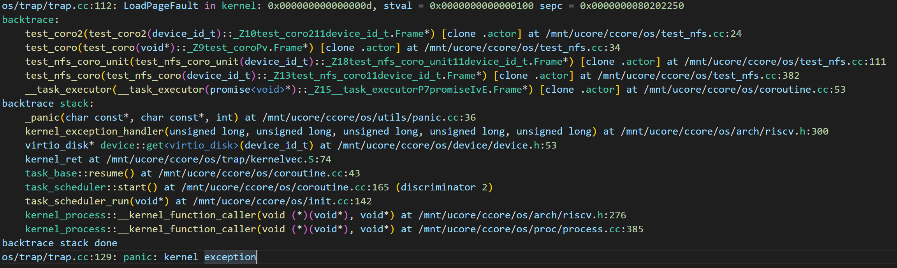

# Coro-core

2022F 操作系统课程设计

## 参考实现

2021春季学期：陶天骅的操作系统课程设计 `uCore-SMP`： [源代码仓库和文档](https://github.com/TianhuaTao/uCore-SMP)

## 运行

### 环境

```
riscv64-unknown-elf-gcc (g1ea978e3066) 12.1.0
```

可以下载预编译的工具链并把`bin`加入`PATH`环境变量

```
https://github.com/stnolting/riscv-gcc-prebuilt/releases/download/rv64imc-3.0.0/riscv64-unknown-elf.gcc-12.1.0.tar.gz
```

### 运行

```shell
make run -j4
```

### 调试

```shell
make debug -j4
```

## 已经实现的功能

- 对大部分上层模块用C++的风格(RAII, template)进行了重写。
- 固定大小内存分配器（8,16,32,64,128,256,512字节）
- 协程内部引入了类似异常的机制`co_return task_fail`
- 协程风格的块设备读写
- 一个简单的协程风格的文件系统
- `inode/dentry`缓存
- `debug`模式下对协程栈和线程栈的`backtrace`, 使用`gdb`可以在内核异常处获得完整的调试信息



- 用户态elf格式文件加载执行（未完成`syscall`)

## 代码结构

```
assets/ 			进展报告资源
reports/			中期和期末汇报
bootloader/			opensbi
nfs/				磁盘镜像
os/				主要代码
	arch/			架构相关代码，中断和上下文切换等
	atomic/			锁
	ccore/			一些宏定义和类型定义
	cxx/			c++裸机运行支持库
	device/			设备，块设备，块设备缓存
	drivers/		串口，虚拟磁盘，内存盘驱动
	file/			未完成的文件相关syscall
	fs/			文件系统
	mm/			内存管理，内存分配器
	proc/			进程管理，调度器，elf加载器
	sbi/			sbi接口
	syscall/		syscall分发
	test/			一些测试
	trap/			trap入口
	utils/			一些数据结构
	coroutine.h		协程库
	kernel.ld		链接脚本
	init.cc			内核入口
		
third_party/			第三方内存分配器
user/				用户空间程序（仅用于测试elf加载器）
backtrace.py			自动解析backtrace地址
dev_log.md			进展报告

```

